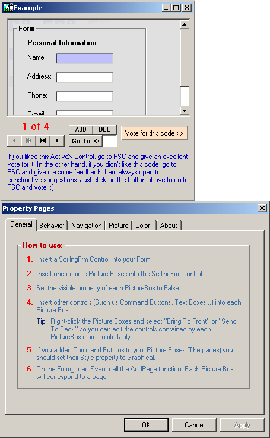



## aaa UPDATED \(03\-28\-2002\) A very good Form with Scroll Bars ActiveX Control Version 2

### Description

I have just done a major update! This Form with Scroll Bars Control has everything that you always dreamed of on a Scrolling Form and more! Following is a list of the most important features available on this versatile ActiveX Control: 

----

(1) The Form will scroll vertically and horizontally! 

----

(2) It will scroll automatically to the field with focus if the field is out of site. 

----

(3) It will highlight the field or button that has the Focus (Actually, any Control inside of the Scrolling Form that can get focus). 

----

(4) Besides been able to optimize the space on your applications by been able to scroll in any direction, you can now flip pages! This feature is much like a wizard’s page. The control will track the number of added pages and which page is currently been viewed. 

----

(5) The control will memorize the last field selected and the scroll bars position on every page. Therefore, whenever you move to a new page, you can opt to have the Scrolling Form ActiveX automatically select the last field selected on the corresponding page or select the first field of the page. 

----

(6) The Control can automatically select the text of every Text Box selected. 

----

(7) You can add a background picture to the control. This picture will be set as the background picture of every added page! 

----

(8) You can set the background color of the control. This color will be set as the background color of every added page! 

----

All of these features are neatly packed as an ActiveX Control. It is very easy to use! What are you waiting for?!! Go ahead and download it! The Source Code of the OCX is included and is heavily commented!!
 
### More Info
 

             |
---                |---
**Submitted On**   |2002-03-28 11:15:56
**By**             |[Elias Barbosa](https://github.com/Planet-Source-Code/PSCIndex/blob/master/ByAuthor/elias-barbosa.md)
**Level**          |Advanced
**User Rating**    |4.8 (297 globes from 62 users)
**Compatibility**  |VB 6\.0
**Category**       |[Custom Controls/ Forms/  Menus](https://github.com/Planet-Source-Code/PSCIndex/blob/master/ByCategory/custom-controls-forms-menus__1-4.md)
**World**          |[Visual Basic](https://github.com/Planet-Source-Code/PSCIndex/blob/master/ByWorld/visual-basic.md)
**Archive File**   |[aaa\_UPDATE661923282002\.zip](https://github.com/Planet-Source-Code/elias-barbosa-aaa-updated-03-28-2002-a-very-good-form-with-scroll-bars-activex-control-ver__1-32374/archive/master.zip)

